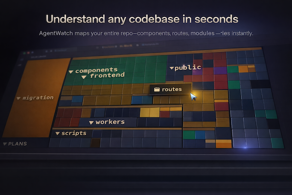
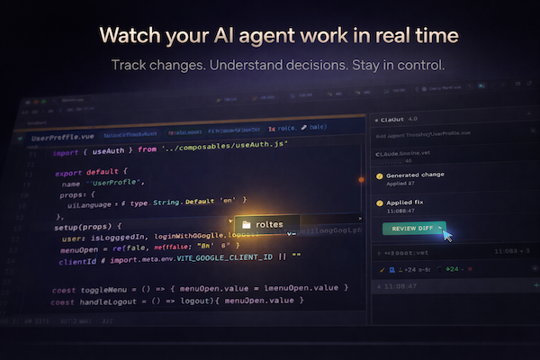
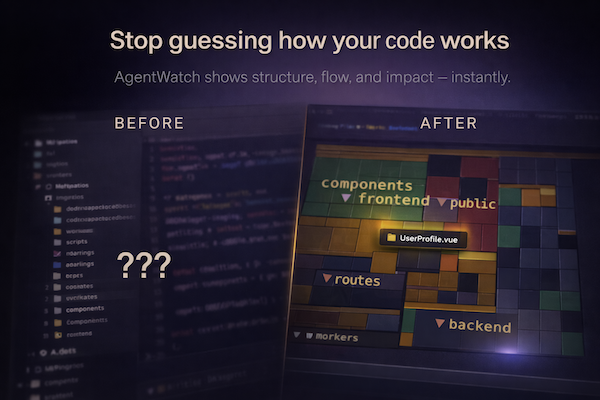

# AgentWatch

**A new kind of IDE — built for the era where the AI is the developer.**

[](https://github.com/Mdeux25/agentwatch/stargazers)
[](https://github.com/Mdeux25/agentwatch/network)


Most IDEs put AI in a sidebar. AgentWatch flips that — Claude is the primary actor, the human is the director. The interface is built around *watching, guiding, and understanding* an AI agent as it works through your codebase.

> ⚠️ Early alpha — macOS only for now. Requires [Claude Code](https://claude.ai/code) to be installed.

---

## v1 Demo

[](https://youtu.be/-8apdKWbR60)

---

## Screenshots



<table>
  <tr>
    <td></td>
    <td></td>
  </tr>
  <tr>
    <td align="center"><em>Watch your AI agent work in real time</em></td>
    <td align="center"><em>Before vs after — see every change spatially</em></td>
  </tr>
</table>

---

## What it looks like

- **A living 3D map of your codebase** — files arranged as a squarified treemap in 3D space. As Claude reads and edits files, its agent sphere jumps between tiles in real time. You can *see* where activity is concentrated.
- **Claude's avatar** — a pulsing dot that reflects emotional state: thinking, working, speaking, idle. Not a chat box. A presence.
- **Live diff panel** — every edit Claude makes streams in as a diff. Full edit history grouped by file or by task.
- **A real code editor** — syntax highlighting, symbol navigation, live editing. You can still write code, it's just not the main event.

---

## The idea

Current AI coding tools are Copilot inside a traditional IDE. That's the 2023 paradigm.

The next paradigm is: **the AI drives, you supervise.** The interface should be built for that — spatial awareness of what the agent is doing, audit trail of every change, ability to redirect mid-task.

AgentWatch is an early exploration of what that IDE looks like.

---

## Stack

| Layer | Tech |
|---|---|
| Desktop shell | [Tauri v2](https://tauri.app) (Rust) |
| UI | React 18 + TypeScript |
| 3D scene | [React Three Fiber](https://r3f.docs.pmnd.rs) + Three.js |
| Animations | Framer Motion |
| State | Zustand |
| AI backend | [Claude Code](https://claude.ai/code) subprocess |

The app runs Claude Code as a subprocess and streams its events (tool use, thinking, edits, messages) into the UI in real time.

---

## Features

- **3D treemap explorer** — squarified treemap layout with zoom-aware label density. Labels appear progressively as you zoom in. File types have distinct colors and extension badges.
- **Spread tree mode** — alternative force-layout view of the file hierarchy.
- **Agent spheres** — each Claude session gets a colored sphere that moves across the map as files are touched.
- **Edit history panel** — browse all edits by file or by conversation turn, with inline diffs.
- **Gitignore-aware scan** — uses the Rust `ignore` crate for accurate `.gitignore` support. Toggle on/off from the explorer header.
- **Hidden file filtering** — `.git`, `.DS_Store`, dot-directories always excluded.
- **Project memory** — repo summaries generated by Claude and cached in localStorage. Opens fast on return visits.
- **Recent projects** — native folder picker with recent project list on first launch.
- **Symbol navigation** — functions, classes, and variables extracted from open files as clickable chips.
- **Font size control** — A- / A+ buttons scale all scene labels globally.
- **Usage dashboard** — token usage and USD cost tracked per task, per project, per day, monthly, and all-time. Persists to `~/.agentwatch/usage.jsonl` across sessions. Includes a 7-day cost bar chart, per-task input/output token split bars, and a project breakdown donut chart.
- **File mind map** — force-directed dependency graph of your codebase. Open a file to see it expanded with its direct imports as unexplored (black-box) nodes. Click any black-box to expand it; collapse back with one click. Scan the full project to add all files as nodes at once.
- **File summaries** — every file you open gets a Claude-generated human-readable summary (symbols, endpoints, notable patterns) rendered in a **Summary** tab. Also writes a compact `.ctx.md` for token-efficient context in future Claude sessions. Both saved to `.agentwatch/context/` (auto-added to `.gitignore`). Summaries regenerate automatically when Claude edits a file.
- **Architecture Intelligence (ARCH tab)** — LLM-powered architecture panel, default view when opening the map tab. Three progressive phases: **(1) instant** — tech stack detected from file extensions and npm imports, architectural layers grouped from directory structure; **(2) async Claude enrichment** — health status per layer (healthy / review / critical), global design patterns, and insights with shimmer skeletons while loading; **(3) cached** — results persisted to `localStorage` so re-opens are instant. Click any layer card to drill in: each layer gets its own focused Claude call with a per-layer summary, patterns, and insights that cite specific filenames. Context-full errors are handled automatically with 4 truncation levels — large projects always complete without manual intervention.

---

## Getting started

### Prerequisites

- [Rust](https://rustup.rs/) (stable)
- [Node.js](https://nodejs.org/) 18+
- [Claude Code CLI](https://claude.ai/code) installed and authenticated

### Run

```bash
git clone https://github.com/Mdeux25/claudeAvatar
cd claudeAvatar
npm install
npm run tauri dev
```

Open a project folder from the welcome screen. AgentWatch will scan the directory, render the file tree, and Claude will generate a brief repo overview.

From there, use the chat panel to give Claude tasks. Watch the 3D map as it works.

---

## How it works

AgentWatch launches `claude` as a subprocess and listens to its event stream over Tauri IPC:

```
user prompt → claude subprocess → event stream (tool_use, thinking, assistant_message, ...)
                                        ↓
                              React UI processes events:
                              - tool_use → move agent sphere to file
                              - Edit/Write → update diff panel + edit history
                              - assistant_message → chat log + avatar state
```

The 3D scene reacts to the event stream in real time — no polling, no scraping, pure event-driven.

---

## Project structure

```
src/
  components/
    scene/          # 3D treemap, spread tree, agent spheres
    mindmap/
      ArchPanel.tsx       # Architecture Intelligence panel (3-phase LLM analysis)
      ForceCanvas.tsx     # Force-directed dependency graph
      MindMapPanel.tsx    # ARCH tab shell + auto-scan + view toggle
      MapNodeEl.tsx       # Individual file node (React.memo)
      PseudoPanel.tsx     # Symbol pseudo-code popover
    AvatarDot.tsx   # Claude's pulsing presence indicator
    ChatInput.tsx   # Prompt input with slash commands
    CodeEditorPanel.tsx
    DiffPanel.tsx
    EditHistoryPanel.tsx
    WelcomeModal.tsx
  lib/
    diffUtils.ts    # Diff parsing + rendering
    editHistory.ts  # Session edit history derivation
    metaFileGen.ts  # Claude summary HTML + .ctx.md generator
    mindMapBuilder.ts
    mindMapStorage.ts
    quadTree.ts     # Tree layout math
    syntaxHighlight.ts
    tauri.ts        # Tauri IPC wrappers
  store/
    useStore.ts     # Zustand global state
  types/
    events.ts       # Claude event type definitions
src-tauri/
  src/
    lib.rs          # File I/O, directory scan, folder dialog
    claude/         # Claude subprocess management
```

---

## Roadmap ideas

- [ ] Multiple simultaneous agent sessions (parallel spheres)
- [ ] Folder drill-down (click folder → treemap focuses on its contents)
- [ ] Time-lapse replay of a session's file activity
- [ ] Heatmap mode — files colored by how often they've been touched
- [ ] Voice input for prompts
- [ ] MCP server integration for external tool visibility

---

## Philosophy

> Most developer tools are built around the assumption that a human writes code and a machine assists. That assumption is expiring.
>
> AgentWatch is built on the opposite assumption: the machine does the work, the human provides direction and judgment. The interface follows from that — spatial, observational, supervisory.
>
> It's early. The paradigm isn't fully formed. But the direction is clear.

---

## Contributing

Early days — issues and PRs welcome. If you're building something in this space or have ideas about what the "AI-native IDE" should look like, open a discussion.

---

## License

MIT
